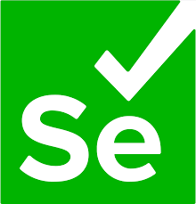
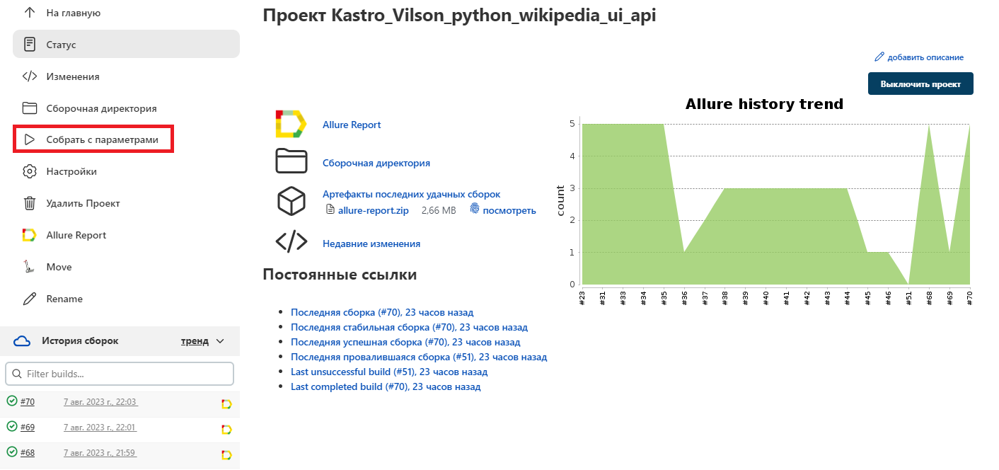
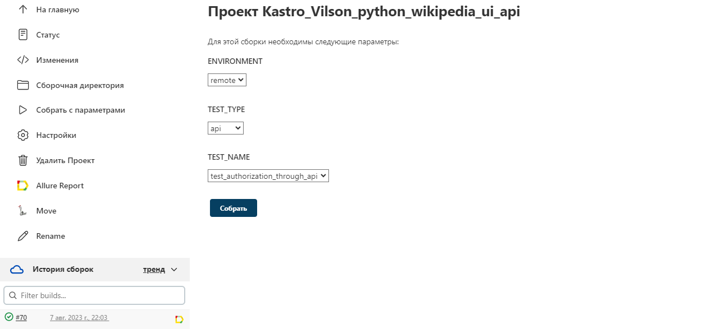
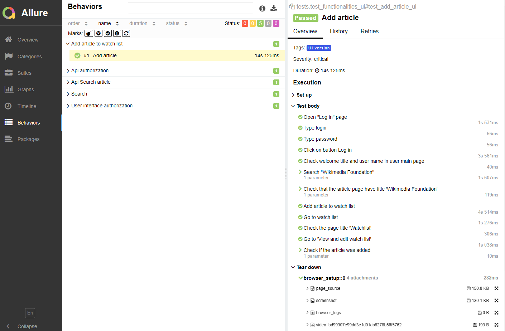

## Дипломный проект автоматизации тестирования на Python для сайта https://en.wikipedia.org/

### Проект содержит UI и API тесты
* UI тесты
    * User authorization through user interface
    * Search an article
    * Add article
* API тесты
    * User authorization through API
    * Search article through API


## Используемые технологии
<p  align="center">
  <code></code>
  <code></code>
  <code></code>
  <code></code>
  <code></code>
  <code></code>
  <code></code>
  <code></code>
  <code></code>
</p>


## Запуск тестов


##  Запуск тестов из [Jenkins](https://jenkins.autotests.cloud/job/Kastro_Vilson_python_wikipedia_ui_api/)
#### После настройки  проекта в Jenkins и нажатия на кнопку "Собрать с параметрами", выбирать environment запуска, тип и название теста, далее начнется сборка тестов и их прохождение через виртуальную машину в Selenoid.

<p></p>

<p></p>

#### После прохождения тестов, результат отображается в Allure отчете

##  Пример отчетов в [Allure](https://jenkins.autotests.cloud/job/Kastro_Vilson_python_wikipedia_ui_api/68/allure/)

## В отчетах Allure для каждого UI-теста прикреплен скриншот, лог, html-страницы и видео прохождения теста

<p></p>

### Пример прохождения теста на видео


<p align="center">
  
</p>


## Локальный запуск тестов

Локальный запуск происходит по команде:
```
python -m pytest tests/test_functionalities_api.py . --environment=local
```

## или
```
python -m pytest tests/test_functionalities_api.py::test_authorization_throug
h_api --environment=local

```

## Удаленный запуск
Удаленный запуск с параметрами происходит по команде:

```
python -m venv .venv
source .venv/bin/activate
pip install --upgrade pip 
pip install poetry
poetry update
if [ "$TEST_TYPE" = "ui+api" ]
then
	pytest tests . --environment=${ENVIRONMENT} --alluredir=allure-results
else
	pytest tests/test_functionalities_${TEST_TYPE}.py::${TEST_NAME} --environment=${ENVIRONMENT} --alluredir=allure-results
fi
```